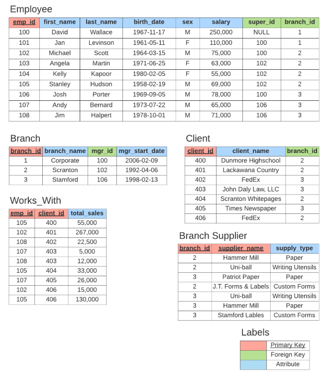

# 🗄️ SQL Journey

> A personal log of my SQL learning — notes, snippets, and the **company database** capstone project.

[](#)
[](#)
[](#)

---

## 📚 Table of Contents

| # | Lesson | Topic | Source |
|---|--------|-------|--------|
| 1 | `sql1.pdf` | SQL Fundamentals — Part 1 | [📄](./sql1.pdf) |
| 2 | `sql2.pdf` | SQL Fundamentals — Part 2 | [📄](./sql2.pdf) |
| 3 | `sql3.pdf` | SQL Fundamentals — Part 3 | [📄](./sql3.pdf) |
| 4 | `sql4.pdf` | SQL Fundamentals — Part 4 | [📄](./sql4.pdf) |
| 5 | `sql5_init_company_db.sql` | Company Database Project | [💾](./sql5_init_company_db.sql) |

---

## 🚀 What's Inside

### 1️⃣ `sql1.pdf` — SQL Fundamentals Part 1
> *📝 Note: PDF is image-based and the text layer is empty — see ⚠️ below.*

### 2️⃣ `sql2.pdf` — SQL Fundamentals Part 2
> *📝 Note: PDF is mostly image-based. Only a small text fragment is extractable.*

<details>
<summary>🔍 Extractable snippet from <code>sql2.pdf</code></summary>

```sql
CREATE TABLE student(
    student_id INT,
    name varchar(20),
    major varchar(20),
    PRIMARY KEY(student_id)
);
```

**Online database:** Aiven is used as the cloud-hosted MySQL instance.

**Practice snippet:**

```sql
ALTER TABLE student ADD gpa DECIMAL(3,2);
```

</details>

### 3️⃣ `sql3.pdf` — SQL Fundamentals Part 3
> *📝 Note: Same notes as `sql2.pdf` (the visible text fragments are identical).*

<details>
<summary>🔍 Extractable snippet from <code>sql3.pdf</code></summary>

```sql
CREATE TABLE student(
    student_id INT,
    name varchar(20),
    major varchar(20),
    PRIMARY KEY(student_id)
);
```

```sql
ALTER TABLE student ADD gpa DECIMAL(3,2);
```

</details>

### 4️⃣ `sql4.pdf` — SQL Fundamentals Part 4
> *📝 Note: PDF is image-based and the text layer is empty — see ⚠️ below.*

---

## 🏢 5️⃣ Company Database — The Capstone Project

The fifth lesson ties everything together by building a complete **relational company database** from scratch.

### 🗺️ Schema Overview



> 📐 **Tables:** `employee` → `branch` → `client` → `works_with` → `branch_supplier`

### 🔗 Relationships at a Glance

| Parent Table | Child Table | Foreign Key | On Delete |
|---|---|---|---|
| `employee` | `branch` | `mgr_id` | `SET NULL` |
| `employee` | `employee` | `super_id` | `SET NULL` |
| `branch` | `employee` | `branch_id` | `SET NULL` |
| `branch` | `client` | `branch_id` | `SET NULL` |
| `employee` + `client` | `works_with` | composite | `CASCADE` |
| `branch` | `branch_supplier` | `branch_id` | `CASCADE` |

### 📦 Tables Created

#### 👨‍💼 `employee`
```sql
CREATE TABLE employee(
    emp_id      INT PRIMARY KEY,
    first_name  VARCHAR(40),
    last_name   VARCHAR(40),
    birth_date  DATE,
    sex         VARCHAR(1),
    salary      INT,
    super_id    INT,
    branch_id   INT
);
```

#### 🏬 `branch`
```sql
CREATE TABLE branch(
    branch_id       INT PRIMARY KEY,
    branch_name     VARCHAR(40),
    mgr_id          INT,
    mgr_start_date  DATE,
    FOREIGN KEY(mgr_id)
        REFERENCES employee(emp_id)
        ON DELETE SET NULL
);
```

#### 👥 `client`
```sql
CREATE TABLE client(
    client_id   INT PRIMARY KEY,
    client_name VARCHAR(20),
    branch_id   INT,
    FOREIGN KEY (branch_id)
        REFERENCES branch(branch_id)
        ON DELETE SET NULL
);
```

#### 🤝 `works_with`
```sql
CREATE TABLE works_with(
    emp_id      INT,
    client_id   INT,
    total_sales INT,
    PRIMARY KEY (emp_id, client_id),
    FOREIGN KEY (emp_id)
        REFERENCES employee(emp_id)
        ON DELETE CASCADE,
    FOREIGN KEY (client_id)
        REFERENCES client(client_id)
        ON DELETE CASCADE
);
```

#### 📦 `branch_supplier`
```sql
CREATE TABLE branch_supplier(
    branch_id     INT,
    supplier_name VARCHAR(20),
    supply_type   VARCHAR(20),
    PRIMARY KEY (branch_id, supplier_name),
    FOREIGN KEY (branch_id)
        REFERENCES branch(branch_id)
        ON DELETE CASCADE
);
```

### ▶️ How to Run It
```bash
mysql -u root -p < sql5_init_company_db.sql
```
Then verify with:
```sql
SHOW TABLES;
```

---

## ⚠️ Important Note About the Source PDFs

The four source PDFs (`sql1.pdf`, `sql2.pdf`, `sql3.pdf`, `sql4.pdf`) are **scanned/image-based documents** — they contain no embedded text layer, only rendered images of handwritten or typed notes. Without OCR tooling available on this machine (`tesseract` is not installed and cannot be installed without `sudo`), the visual content of those pages cannot be transcribed into this README.

The only verifiable content shown above for lessons 1–4 is what `pdftotext` / `pymupdf` could recover from the PDF text streams — which is sparse. To fully document lessons 1–4, please either:

1. Install an OCR tool (e.g. `sudo apt install tesseract-ocr`), or
2. Re-export the notes from the Google Docs source as **text PDFs** (rather than scanned images).

---

## 🧰 Tools Used

| Tool | Purpose |
|---|---|
| 🐬 **MySQL** | Database engine for the company DB project |
| ☁️ **Aiven** | Hosted MySQL instance used in lessons 2 & 3 |
| 📄 **PDF** | Source notes (`sql1.pdf` → `sql4.pdf`) |

---

<div align="center">

**✨ Made with curiosity & a lot of `SELECT * FROM` ✨**

⭐ *Star this repo if it helped you learn something new!* ⭐

</div>
